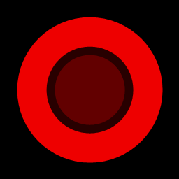
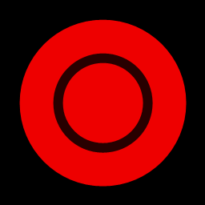

# reddot

`reddot` is a tiny Windows tray monitor. It has no main window and communicates
through a single red dot in the notification area.

The outer dot shows CPU activity. The inner dot shows GPU activity. Brighter red
means more activity.

| State | Meaning |
| --- | --- |
|  | Low CPU and low GPU activity. |
|  | CPU activity is high. |
|  | GPU activity is high. |
|  | CPU and GPU activity are both high. |

Hover the tray icon to show the popup:

```text
CPU 12%
GPU 34%
RAM 56%
HDD 7%
NET 2%
```

`HDD` is the busiest physical disk. `NET` is the busiest network interface
relative to its reported link speed.

Right-click the tray icon and choose `Exit` to quit.

## Install

Download the latest Windows x64 release artifact and run `reddot.exe`.

There is intentionally no installer right now. The application is a single
executable, so a zip keeps distribution small and avoids extra installer
dependencies.

## Build

Open `reddot.sln` in Visual Studio, or build from a Developer PowerShell:

```powershell
msbuild reddot.sln /p:Configuration=Release /p:Platform=x64
```

The GitHub Actions release workflow builds with the Visual Studio 2022 toolset:

```powershell
msbuild reddot.sln /p:Configuration=Release /p:Platform=x64 /p:PlatformToolset=v143
```
