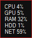

# reddot

`reddot` is a tiny Windows tray monitor. It has no main window and communicates
through a flashing red dot in the notification area.

The outer dot shows CPU activity. The inner dot shows GPU activity. Brighter red
means more activity.

| State | Meaning |
| --- | --- |
|  | Low CPU and low GPU activity. |
|  | CPU activity is high. |
|  | GPU activity is high. |
|  | CPU and GPU activity are both high. |

Hover the tray icon to show the popup:
  
  
  
| Row | Meaning |
| --- | --- |
| `CPU` | Overall CPU activity. |
| `GPU` | Load on busiest GPU. |
| `RAM` | Physical memory load. |
| `HDD` | The busiest physical disk. |
| `NET` | The busiest network interface. |

Right-click the tray icon and choose `Exit` to quit.

## Install

Download the latest Windows x64 release artifact and run `reddot.exe`.

There is intentionally no installer right now. The application is a single
executable, so a zip keeps distribution small and avoids extra installer
dependencies.

## Build

Open `reddot.sln` in Visual Studio, or build from a Developer PowerShell:

```powershell
msbuild reddot.sln /p:Configuration=Release /p:Platform=x64
```

The GitHub Actions release workflow builds with the Visual Studio 2022 toolset:

```powershell
msbuild reddot.sln /p:Configuration=Release /p:Platform=x64 /p:PlatformToolset=v143
```

## Technical notes

- `CPU` uses the Windows performance counter `\Processor Information(_Total)\% Processor Utility` when available. If that counter cannot be read, `reddot` falls back to calculating CPU usage from `GetSystemTimes`.
- `GPU` uses the Windows performance counter `\GPU Engine(*)\Utilization Percentage` and reports the highest engine value. On systems with multiple GPUs, this means the busiest GPU engine wins.
- `RAM` uses `GlobalMemoryStatusEx` and reports `dwMemoryLoad`, which is the percentage of physical memory currently in use.
- `HDD` uses the Windows performance counter `\PhysicalDisk(*)\% Disk Time`, ignores `_Total`, and reports the busiest physical disk. The label says `HDD`, but fixed SSDs are included too.
- `NET` uses the Windows performance counter `\Network Interface(*)\Bytes Total/sec`, ignores loopback and `_Total`, and reports the busiest interface using a coarse activity scale rather than link-speed saturation.
